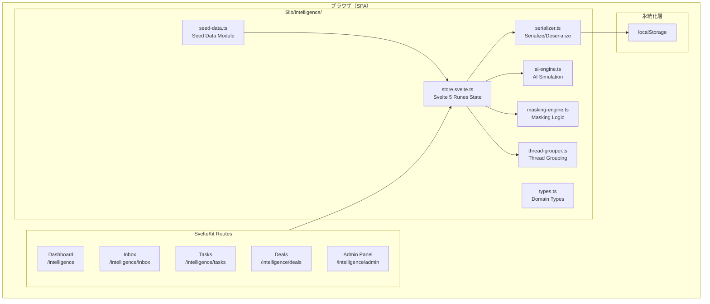
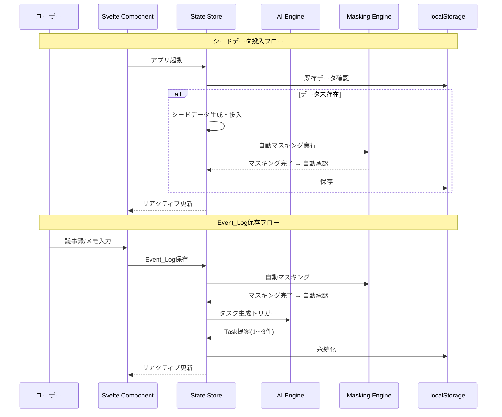
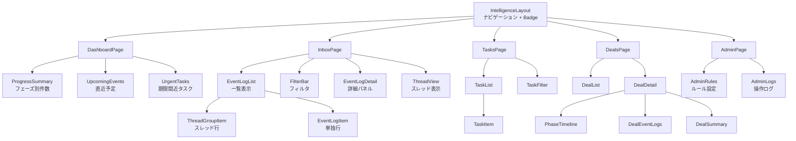

# Design Document: AI Sales Brain

## Overview

Sales Intelligence（AI Sales Brain）は、営業活動に関する全情報（Slack・メール・カレンダー・議事録・メモ）を自動集約し、AIシミュレーションにより行動提案・サマリー生成・検索を提供するフロントエンド機能である。

本設計は以下の制約に基づく：

- **フロントエンドのみ**：SvelteKit（Svelte 5 runes）+ TypeScript + adapter-static による静的SPA
- **データ永続化**：localStorage のみ（バックエンドなし）
- **AI応答**：すべてシミュレーション（テンプレートベースの模擬生成）
- **外部データ**：Slack・メール・カレンダーは事前ロードされたシードデータ
- **スレッド表示**：Slack（thread_ts）、メール（In-Reply-To/References）によるグループ化
- **承認フロー**：マスキング完了 = 自動承認（別途承認ステップなし）
- **Badge表示**：未読件数を表示

既存のSales Hubプロジェクト（案件リレー型ワークフローツール）に新規機能として追加する。既存のイベントソーシング構造・ロール切替・案件管理の仕組みとは独立した画面群として実装する。

## Architecture

### システム全体構成



### データフロー



### ルーティング設計

本機能は既存のSales Hubとは独立した画面群として `/intelligence` 配下にルーティングする。SvelteKitのファイルベースルーティングを使用するが、adapter-staticによる静的ビルドのため、実質的にはクライアントサイドナビゲーションで動作する。

| パス                  | 画面        | 説明                              |
| --------------------- | ----------- | --------------------------------- |
| `/intelligence`       | Dashboard   | ホーム画面（進捗・予定・タスク）  |
| `/intelligence/inbox` | Inbox       | Event_Log一覧・詳細・スレッド表示 |
| `/intelligence/tasks` | Tasks       | タスク管理                        |
| `/intelligence/deals` | Deals       | 案件一覧・詳細                    |
| `/intelligence/admin` | Admin Panel | 管理者設定・ログ                  |

## UI Design Guidelines

### カラーパレット

Salesforce Lightning Design System を参考にした、ブルー基調 + イエロー差し色のカラースキーム。

| 用途          | カラー名      | 値        | 説明                                               |
| ------------- | ------------- | --------- | -------------------------------------------------- |
| Primary       | Brand Blue    | `#0176D3` | メインアクション、ナビゲーションアクティブ、リンク |
| Primary Dark  | Navy          | `#032D60` | ヘッダー、サイドバー背景                           |
| Primary Light | Cloud Blue    | `#EEF4FF` | カード背景、セクションハイライト                   |
| Accent        | Golden Yellow | `#FFC72C` | Badge、重要通知、優先度（高）、CTA強調             |
| Accent Hover  | Dark Gold     | `#E6A800` | Accent要素のホバー状態                             |
| Success       | Green         | `#2E844A` | 完了ステータス、承認済、正常通知                   |
| Warning       | Orange        | `#DD7A01` | 期限間近、注意通知                                 |
| Error         | Red           | `#EA001E` | エラーメッセージ、期限超過、却下                   |
| Neutral 100   | White         | `#FFFFFF` | メインコンテンツ背景                               |
| Neutral 200   | Light Gray    | `#F3F3F3` | ページ全体背景                                     |
| Neutral 400   | Border Gray   | `#DDDDDD` | ボーダー、区切り線                                 |
| Neutral 700   | Dark Gray     | `#3E3E3C` | 本文テキスト                                       |
| Neutral 900   | Near Black    | `#181818` | 見出しテキスト                                     |

### CSS変数定義

```css
:root {
	/* Primary */
	--color-brand: #0176d3;
	--color-brand-dark: #032d60;
	--color-brand-light: #eef4ff;
	--color-brand-hover: #014486;

	/* Accent */
	--color-accent: #ffc72c;
	--color-accent-hover: #e6a800;
	--color-accent-light: #fff8e1;

	/* Semantic */
	--color-success: #2e844a;
	--color-warning: #dd7a01;
	--color-error: #ea001e;

	/* Neutral */
	--color-bg: #f3f3f3;
	--color-surface: #ffffff;
	--color-border: #dddddd;
	--color-text: #3e3e3c;
	--color-text-heading: #181818;
	--color-text-muted: #706e6b;

	/* Spacing */
	--space-xs: 4px;
	--space-sm: 8px;
	--space-md: 16px;
	--space-lg: 24px;
	--space-xl: 32px;

	/* Border Radius */
	--radius-sm: 4px;
	--radius-md: 8px;
	--radius-lg: 12px;

	/* Shadow */
	--shadow-card: 0 2px 4px rgba(0, 0, 0, 0.1);
	--shadow-elevated: 0 4px 12px rgba(0, 0, 0, 0.15);

	/* Font */
	--font-family:
		-apple-system, BlinkMacSystemFont, 'Segoe UI', 'Hiragino Sans', 'Noto Sans JP', sans-serif;
	--font-size-xs: 11px;
	--font-size-sm: 13px;
	--font-size-md: 14px;
	--font-size-lg: 16px;
	--font-size-xl: 20px;
	--font-size-2xl: 24px;
}
```

### レイアウト構成

```
┌──────────────────────────────────────────────────────────┐
│  Header (Navy背景 + ロゴ + 検索バー + ユーザーアイコン)     │
├────────┬─────────────────────────────────────────────────┤
│        │  リマインダー通知バー（Golden Yellow背景）         │
│  Side  ├─────────────────────────────────────────────────┤
│  Nav   │                                                 │
│        │  メインコンテンツエリア（White背景カード）          │
│ (Navy  │                                                 │
│  背景) │                                                 │
│        │                                                 │
│ 📊     │                                                 │
│ 📥(3)  │                                                 │
│ ✅(5)  │                                                 │
│ 💼     │                                                 │
│ ⚙️     │                                                 │
│        │                                                 │
├────────┴─────────────────────────────────────────────────┤
│  (フッターなし - SPAのため)                                │
└──────────────────────────────────────────────────────────┘
```

- **サイドバー**: Navy（`#032D60`）背景、アイコン + ラベルの縦型ナビ。アクティブ項目は左ボーダー（Brand Blue）で強調
- **Badge**: Golden Yellow（`#FFC72C`）背景に白文字。件数0の場合は非表示
- **リマインダーバー**: Accent Light（`#FFF8E1`）背景 + Golden Yellowの左ボーダー
- **カード**: White背景 + `shadow-card` + `radius-md`

### コンポーネントスタイルガイド

| コンポーネント       | スタイル                                                                                         |
| -------------------- | ------------------------------------------------------------------------------------------------ |
| プライマリボタン     | Brand Blue背景、白文字、radius-sm                                                                |
| セカンダリボタン     | 白背景、Brand Blueボーダー + テキスト                                                            |
| アクセントボタン     | Golden Yellow背景、Navy文字（CTAや承認）                                                         |
| Badge                | Golden Yellow背景、白文字、pill形状                                                              |
| カード               | White背景、shadow-card、radius-md、padding: space-lg                                             |
| テーブル行（ホバー） | Cloud Blue背景                                                                                   |
| 期限超過行           | 薄赤背景（`#FFF0F0`）                                                                            |
| タブ（アクティブ）   | Brand Blue下線 + Brand Blueテキスト                                                              |
| 入力フィールド       | border: Neutral 400、focus: Brand Blue                                                           |
| スレッド区切り線     | Neutral 400の実線（1px）                                                                         |
| フェーズステッパー   | Brand Blueの●（完了）、Neutral 400の○（未到達）、Golden Yellow●（現在）                          |
| 優先度バッジ         | 高: Error Red / 中: Golden Yellow / 低: Success Green                                            |
| ソースアイコン       | Slack: `#4A154B` / メール: Brand Blue / カレンダー: Success / 議事録: Neutral 700 / メモ: Accent |

### レスポンシブ方針

- デスクトップファースト（営業はPC利用が主）
- 最小幅: 1024px（それ以下は想定外）
- サイドバーは常時表示（折りたたみなし）

## Components and Interfaces

### コンポーネントツリー



### 主要モジュールのインターフェース

#### AI Engine (`$lib/intelligence/ai-engine.ts`)

```typescript
export interface AIEngine {
	/** Event_Logに基づくTask模擬生成（1〜3件） */
	generateTasks(eventLog: EventLog, deals: Deal[]): Task[];

	/** Dealサマリー模擬生成（最大500文字） */
	generateSummary(deal: Deal, eventLogs: EventLog[]): DealSummary;

	/** 模擬検索（関連度スコア降順、最大20件） */
	search(query: string, eventLogs: EventLog[], deals: Deal[], tasks: Task[]): SearchResult[];

	/** フェーズ変更検出・提案 */
	detectPhaseChange(deal: Deal, eventLogs: EventLog[]): PhaseChangeProposal | null;

	/** データ自動更新提案 */
	detectDataUpdate(eventLog: EventLog, deals: Deal[]): DataUpdateProposal[];

	/** 振り返り改善提案（1〜3件） */
	generateRetrospective(eventLogs: EventLog[], tasks: Task[]): RetrospectiveResult;
}
```

#### Masking Engine (`$lib/intelligence/masking-engine.ts`)

```typescript
export interface MaskingEngine {
	/** ルールに基づく自動マスキング */
	autoMask(text: string, rules: MaskingRule[]): MaskingResult;

	/** 選択範囲の手動マスキング */
	manualMask(text: string, start: number, end: number): MaskingResult;

	/** マスキング復元 */
	restore(maskedText: string, originalText: string): string;
}

export interface MaskingResult {
	maskedText: string;
	originalText: string;
	maskedRanges: Array<{ start: number; end: number }>;
}
```

#### Thread Grouper (`$lib/intelligence/thread-grouper.ts`)

```typescript
export interface ThreadGrouper {
	/** Event_Logをスレッド単位にグループ化 */
	groupByThread(eventLogs: EventLog[]): ThreadGroup[];

	/** スレッド内メッセージを時系列昇順で取得 */
	getThreadMessages(threadGroup: ThreadGroup): EventLog[];
}
```

#### Serializer (`$lib/intelligence/serializer.ts`)

```typescript
export interface Serializer {
	/** Event_Logの配列をJSON文字列にシリアライズ */
	serializeEventLogs(logs: EventLog[]): string;

	/** JSON文字列からEvent_Logの配列にデシリアライズ（日時復元含む） */
	deserializeEventLogs(json: string): EventLog[];

	/** Deal配列のシリアライズ/デシリアライズ */
	serializeDeals(deals: Deal[]): string;
	deserializeDeals(json: string): Deal[];

	/** Task配列のシリアライズ/デシリアライズ */
	serializeTasks(tasks: Task[]): string;
	deserializeTasks(json: string): Task[];
}
```

#### Store (`$lib/intelligence/store.svelte.ts`)

Svelte 5 runes（`$state`, `$derived`）を使用したリアクティブ状態管理。

```typescript
// グローバル状態（$state rune）
let eventLogs = $state<EventLog[]>([]);
let deals = $state<Deal[]>([]);
let tasks = $state<Task[]>([]);
let settings = $state<AppSettings>(defaultSettings);
let operationLogs = $state<OperationLog[]>([]);

// 派生状態（$derived rune）
let unreadCount = $derived(eventLogs.filter((l) => !l.isRead && !l.isDeleted).length);
let pendingTaskCount = $derived(tasks.filter((t) => t.status !== 'completed').length);
let threadGroups = $derived(threadGrouper.groupByThread(eventLogs));

// ストアAPI（エクスポート関数）
export function addEventLog(log: EventLog): void;
export function updateEventLog(id: string, updates: Partial<EventLog>): void;
export function deleteEventLog(id: string): void;
export function addDeal(deal: Deal): void;
export function updateDeal(id: string, updates: Partial<Deal>): void;
export function addTask(task: Task): void;
export function updateTaskStatus(id: string, newStatus: TaskStatus): void;
export function saveSettings(settings: AppSettings): void;
export function clearAllData(): void;
export function initializeFromStorage(): void;
```

## Data Models

### Event_Log

```typescript
interface EventLog {
	id: string; // UUID
	source: DataSource; // 'slack' | 'email' | 'calendar' | 'minutes' | 'memo'
	title: string; // 件名 or タイトル（最大200文字）
	body: string; // 本文
	timestamp: Date; // 記録日時（ISO 8601）
	createdAt: Date; // 作成日時

	// Slack固有
	slackSender?: string; // 送信者名
	slackChannel?: string; // チャンネル名
	threadTs?: string; // スレッドID（thread_ts）

	// メール固有
	emailFrom?: string; // 送信者メールアドレス
	emailTo?: string; // 受信者メールアドレス
	emailSubject?: string; // 件名（最大200文字）
	messageId?: string; // Message-ID
	inReplyTo?: string; // In-Reply-To
	references?: string[]; // References

	// カレンダー固有
	eventName?: string; // イベント名
	startTime?: Date; // 開始日時
	endTime?: Date; // 終了日時
	attendees?: string[]; // 参加者
	location?: string; // 場所

	// 関連
	dealId?: string; // 関連Deal ID

	// ステータス
	status: EventLogStatus; // 'pending' | 'approved' | 'rejected'
	approvalType?: ApprovalType; // 承認種別
	approvalAt?: Date; // 承認日時
	rejectedBy?: string; // 却下者
	rejectedAt?: Date; // 却下日時
	rejectionReason?: string; // 却下理由

	// マスキング
	maskedBody?: string; // マスキング後テキスト
	originalBody?: string; // マスキング前テキスト
	isMasked: boolean; // マスキング済みフラグ

	// 追記・コメント
	annotations: Annotation[]; // 追記
	comments: Comment[]; // コメント

	// 状態フラグ
	isRead: boolean; // 既読フラグ
	isDeleted: boolean; // 論理削除フラグ
}

type DataSource = 'slack' | 'email' | 'calendar' | 'minutes' | 'memo';
type EventLogStatus = 'pending' | 'approved' | 'rejected';
type ApprovalType =
	| 'auto_masking_complete'
	| 'auto_manual_masking_complete'
	| 'auto_no_masking_needed';
```

### Deal

```typescript
interface Deal {
	id: string; // UUID
	name: string; // 案件名
	phase: DealPhase; // 現在フェーズ
	assignee: string; // 担当者
	createdAt: Date; // 作成日時
	updatedAt: Date; // 更新日時
	summary?: DealSummary; // 最新サマリー
	phaseHistory: PhaseTransition[]; // フェーズ遷移履歴
}

type DealPhase =
	| 'qualification' // 商談の見極め
	| 'issue_identification' // 課題の特定
	| 'value_proposition' // メリットの訴求
	| 'decision_maker' // 意思決定者の賛同
	| 'risk_elimination' // リスクの排除
	| 'contract_agreement' // 契約合意
	| 'administration' // 事務処理
	| 'closed_won'; // 受注成約完了

interface PhaseTransition {
	fromPhase: DealPhase;
	toPhase: DealPhase;
	transitionAt: Date;
	operator: string;
	changeType: 'ai_proposal_accepted' | 'manual';
}

interface DealSummary {
	text: string; // サマリーテキスト（最大500文字）
	generatedAt: Date; // 生成日時
	periodStart: Date; // 対象期間開始
	periodEnd: Date; // 対象期間終了
	hasUpdates: boolean; // 更新あり表示用
}
```

### Task

```typescript
interface Task {
	id: string; // UUID
	title: string; // タスク名
	dealId?: string; // 関連Deal ID
	status: TaskStatus; // ステータス
	priority: TaskPriority; // 優先度
	dueDate?: Date; // 期限日時
	createdAt: Date; // 作成日時
	updatedAt: Date; // 更新日時
	source: 'ai' | 'manual'; // 生成元
	isProposal: boolean; // AI提案中フラグ
	rejectedAt?: Date; // 却下日時
}

type TaskStatus = 'not_started' | 'in_progress' | 'completed';
type TaskPriority = 'high' | 'medium' | 'low';
```

### Thread_Group

```typescript
interface ThreadGroup {
	id: string; // スレッドID（thread_ts or message-id）
	source: 'slack' | 'email'; // データソース
	parentMessage: EventLog; // 親メッセージ
	replies: EventLog[]; // リプライ（時系列昇順）
	latestMessageAt: Date; // スレッド内最新日時
	messageCount: number; // メッセージ件数
	representativeDate: Date; // 代表日時（親メッセージの日時）
}
```

### その他モデル

```typescript
interface Annotation {
	id: string;
	content: string; // 最大1000文字
	author: string;
	createdAt: Date;
}

interface Comment {
	id: string;
	content: string; // 最大500文字
	author: string;
	createdAt: Date;
}

interface MaskingRule {
	id: string;
	pattern: string; // 正規表現 or 文字列
	method: 'full' | 'partial' | 'keep_edges'; // マスク方法
	isEnabled: boolean;
}

interface AppSettings {
	maskingRules: MaskingRule[];
	allowedDomains: string[]; // 許可ドメインリスト（最大50件）
	assignmentRules: AssignmentRule[];
	isAdmin: boolean; // 管理者フラグ
}

interface AssignmentRule {
	id: string;
	keyword: string; // 条件キーワード or ドメイン
	assignee: string; // 割当先担当者
}

interface OperationLog {
	id: string;
	operationType: OperationType;
	operatedAt: Date;
	operator: string;
	targetType: 'event_log' | 'deal' | 'task';
	targetId: string;
}

type OperationType =
	| 'event_log_create'
	| 'event_log_edit'
	| 'event_log_delete'
	| 'event_log_approve'
	| 'event_log_reject'
	| 'deal_update'
	| 'task_create'
	| 'task_complete'
	| 'task_delete'
	| 'masking_execute'
	| 'masking_restore';

interface SearchResult {
	type: 'event_log' | 'deal' | 'task';
	id: string;
	title: string;
	excerpt: string; // 本文抜粋
	relevanceScore: number; // 0〜100
}

interface PhaseChangeProposal {
	dealId: string;
	currentPhase: DealPhase;
	proposedPhase: DealPhase;
	reasoning: string; // 変更根拠テキスト
}

interface DataUpdateProposal {
	id: string;
	dealId: string;
	field: string;
	currentValue: string;
	proposedValue: string;
	sourceEventLogId: string; // 根拠Event_Log
}

interface RetrospectiveResult {
	eventLogCount: number;
	taskCompletedCount: number;
	taskPendingCount: number;
	phaseChanges: PhaseTransition[];
	activityPattern: Record<DataSource, number>; // 種別ごと件数分布
	suggestions: string[]; // 改善提案（1〜3件）
}

// タスクリマインダー
interface Reminder {
	taskId: string;
	isDismissed: boolean;
}
```

### localStorage キー設計

| キー                     | 内容                     | 型                       |
| ------------------------ | ------------------------ | ------------------------ |
| `si_event_logs`          | Event_Log一覧            | `EventLog[]` JSON        |
| `si_deals`               | Deal一覧                 | `Deal[]` JSON            |
| `si_tasks`               | Task一覧                 | `Task[]` JSON            |
| `si_settings`            | アプリ設定               | `AppSettings` JSON       |
| `si_operation_logs`      | 操作ログ                 | `OperationLog[]` JSON    |
| `si_seed_initialized`    | シードデータ投入済フラグ | `boolean`                |
| `si_dismissed_reminders` | dismiss済リマインダー    | `string[]`（TaskID配列） |

## Correctness Properties

_A property is a characteristic or behavior that should hold true across all valid executions of a system-essentially, a formal statement about what the system should do. Properties serve as the bridge between human-readable specifications and machine-verifiable correctness guarantees._

### Property 1: シリアライズ・デシリアライズ ラウンドトリップ等価性

_For any_ 有効な EventLog オブジェクト、シリアライズしてからデシリアライズした結果は、元のオブジェクトと全フィールドの値において一致する（日時フィールドの ISO 8601 文字列 ↔ Date 変換を含む）。

**Validates: Requirements 24.1, 24.2, 24.3**

### Property 2: スレッドグループ化の正確性

_For any_ EventLog の集合において、同一の thread_ts を持つ Slack メッセージは同一の ThreadGroup に属し、同一の In-Reply-To/References チェーンに属するメールは同一の ThreadGroup に属し、スレッド識別子を持たない単独メッセージはいずれの ThreadGroup にも属さず個別アイテムとして表示される。

**Validates: Requirements 25.1, 25.2, 25.4, 25.7**

### Property 3: マスキング適用の正確性

_For any_ テキストとマスキングルール（正規表現パターン）の組み合わせにおいて、自動マスキングはルールに一致するすべての箇所を「●」文字で置換し、元のテキストを保持する。また、_For any_ テキストと有効な選択範囲（start, end）において、手動マスキングは選択範囲のみを正確に「●」で置換する。

**Validates: Requirements 5.1, 5.3**

### Property 4: マスキング復元ラウンドトリップ

_For any_ テキストに対してマスキングを適用した後、復元操作を実行すると元のテキストが完全に復元される。

**Validates: Requirements 5.6**

### Property 5: マスキング完了による自動承認

_For any_ EventLog に対してマスキング処理（自動・手動・ルール未設定のいずれか）が完了した場合、当該 EventLog のステータスは「承認済」に変更され、適切な承認種別と承認日時が記録される。

**Validates: Requirements 5.2, 5.4, 5.5**

### Property 6: 空白文字入力の拒否

_For any_ 空文字列または空白文字のみで構成される文字列が保存対象として入力された場合、システムは保存を実行せず、既存のデータ状態は変更されない。これは議事録・メモ・追記・コメント・検索クエリ・却下理由・マスキングパターン・ドメイン入力のすべてに適用される。

**Validates: Requirements 4.3, 6.5, 7.2, 9.4, 17.5, 21.5**

### Property 7: Badge件数の正確性

_For any_ EventLog の集合において、Inbox の Badge は未読（isRead === false かつ isDeleted === false）の EventLog 件数を表示する。_For any_ Task の集合において、タスクの Badge はステータスが「完了」でない Task の件数を表示する。件数が 0 の場合は Badge を非表示にする。

**Validates: Requirements 1.3, 2.4, 3.3, 15.3, 16.2, 23.2**

### Property 8: シードデータ投入の冪等性

_For any_ localStorage の状態において、シードデータ初期化を複数回実行しても、既にデータが存在する場合は再投入を行わず既存データを保持する（f(f(x)) = f(x)）。

**Validates: Requirements 1.4, 2.5, 3.4**

### Property 9: メールドメインフィルタリング

_For any_ メールアドレスと許可ドメインリストの組み合わせにおいて、メールアドレスのドメイン部分が許可リストに含まれない場合は除外され、含まれる場合のみ取り込まれる。

**Validates: Requirements 2.3**

### Property 10: ステータスに基づく表示制御

_For any_ EventLog の集合において、論理削除された（isDeleted === true）EventLog は Inbox・検索結果・Deal 詳細のいずれにも表示されない。却下済（status === 'rejected'）の EventLog は集計対象から除外される。

**Validates: Requirements 6.3, 7.4**

### Property 11: タスクステータス遷移の妥当性

_For any_ Task において、有効なステータス遷移は「未着手→進行中」「進行中→完了」「完了→未着手」の 3 パターンのみであり、それ以外の遷移は拒否される。

**Validates: Requirements 16.3, 16.4**

### Property 12: 検索結果の関連度スコア降順

_For any_ 検索クエリの結果セットにおいて、結果は関連度スコア（0〜100 の整数）の降順で並び、最大 20 件を超えない。

**Validates: Requirements 9.1, 9.2**

### Property 13: AIタスク生成の範囲制約

_For any_ EventLog を入力として AI Engine がタスクを生成する場合、生成件数は 1 以上 3 以下であり、各 Task はタイトル・期限・優先度（高・中・低）を必ず持つ。

**Validates: Requirements 10.1, 10.2**

### Property 14: サマリー生成の制約とインジケーター

_For any_ Deal に紐づく EventLog が 1 件以上存在する場合に生成されるサマリーは最大 500 文字であり、生成日時と対象期間を保持する。_For any_ サマリー生成後にDealに新しいEventLogが追加された場合、hasUpdates が true になる。

**Validates: Requirements 11.1, 11.2, 11.3**

### Property 15: フェーズ遷移履歴の記録

_For any_ Deal のフェーズ変更（AI提案承認または手動変更）において、遷移元・遷移先・遷移日時・操作者・変更種別が PhaseTransition として記録される。_For any_ フェーズ遷移提案の却下において、Deal のフェーズは変更されない。

**Validates: Requirements 8.3, 8.4, 8.5**

### Property 16: ダッシュボード時間窓フィルタリング

_For any_ カレンダー EventLog の集合において、ダッシュボードに表示される予定は開始日時が現在から 24 時間以内のもののみである。_For any_ Task の集合において、ダッシュボードに表示されるタスクは未完了かつ期限が 72 時間以内の上位 5 件（期限昇順）である。

**Validates: Requirements 14.2, 14.3**

### Property 17: 複合フィルタリングのAND結合

_For any_ EventLog の集合とフィルタ条件（期間・データソース種別・Deal・キーワード）の組み合わせにおいて、表示される全ての EventLog はすべてのアクティブなフィルタ条件を同時に満たす。

**Validates: Requirements 18.2**

### Property 18: ページネーション上限

_For any_ 一覧表示において、1ページに表示されるアイテム数は最大 50 件を超えない。

**Validates: Requirements 15.9, 20.5**

## Error Handling

### エラー種別と対応方針

| エラー種別           | 検出条件             | 対応               | ユーザー通知                      |
| -------------------- | -------------------- | ------------------ | --------------------------------- |
| 入力バリデーション   | 空文字・空白のみ     | 保存を実行しない   | フォーム上にエラーメッセージ表示  |
| 無効なステータス遷移 | 許可されていない遷移 | 操作を拒否         | エラーメッセージ表示              |
| localStorage容量超過 | QuotaExceededError   | 保存失敗           | 警告メッセージ + 削除候補提示     |
| localStorage利用不可 | localStorage未対応   | メモリのみで動作   | 警告メッセージ（データ未保存）    |
| データ破損           | JSONパースエラー     | 空の初期状態で起動 | エラーメッセージ + コンソール出力 |
| サマリー生成失敗     | AI Engine内部エラー  | 既存サマリー保持   | 生成失敗メッセージ                |
| 却下理由未入力       | 空文字で却下試行     | 却下を実行しない   | エラーメッセージ表示              |
| 重複却下             | 既に却下済           | 操作を受け付けない | 「既に却下済」メッセージ          |

### バリデーション制約

```typescript
const VALIDATION = {
	// テキスト長制約
	EVENT_LOG_BODY_MAX: 10000, // 議事録本文
	MEMO_BODY_MAX: 5000, // メモ本文
	SLACK_BODY_MAX: 4000, // Slackメッセージ
	EMAIL_SUBJECT_MAX: 200, // メール件名
	ANNOTATION_MAX: 1000, // 追記
	COMMENT_MAX: 500, // コメント
	SUMMARY_MAX: 500, // サマリー
	DOMAIN_MAX: 253, // ドメイン文字数

	// 件数制約
	ALLOWED_DOMAINS_MAX: 50, // 許可ドメインリスト
	SEARCH_RESULTS_MAX: 20, // 検索結果
	AI_TASKS_MIN: 1, // AI生成タスク最小
	AI_TASKS_MAX: 3, // AI生成タスク最大
	SUGGESTIONS_MIN: 1, // 改善提案最小
	SUGGESTIONS_MAX: 3, // 改善提案最大
	PAGE_SIZE: 50, // ページサイズ
	DASHBOARD_TASKS_MAX: 5, // ダッシュボードタスク
	REMINDERS_MAX: 10, // リマインダー最大表示

	// 時間制約
	REMINDER_THRESHOLD_HOURS: 24, // リマインダー閾値
	DASHBOARD_EVENTS_HOURS: 24, // ダッシュボード予定範囲
	DASHBOARD_TASKS_HOURS: 72, // ダッシュボードタスク範囲
	REMINDER_CHECK_INTERVAL_SEC: 60, // リマインダー再チェック間隔
	SAVE_DEBOUNCE_MS: 3000 // localStorage保存デバウンス
} as const;
```

### localStorage エラーハンドリング戦略

```typescript
function safeSave(key: string, data: unknown): boolean {
	try {
		localStorage.setItem(key, JSON.stringify(data));
		return true;
	} catch (e) {
		if (e instanceof DOMException && e.name === 'QuotaExceededError') {
			// 容量超過: ユーザーに通知し削除候補を提示
			showStorageWarning();
			return false;
		}
		// その他のエラー: コンソール出力のみ
		console.error('localStorage save failed:', e);
		return false;
	}
}

function safeLoad<T>(key: string, fallback: T): T {
	try {
		const raw = localStorage.getItem(key);
		if (raw === null) return fallback;
		return JSON.parse(raw) as T;
	} catch (e) {
		console.error(`Failed to parse localStorage key "${key}":`, e);
		return fallback;
	}
}
```

## Testing Strategy

### テスト構成

本機能のテストは以下の2層で構成する。

#### 1. Property-Based Tests（プロパティテスト）

**ライブラリ**: [fast-check](https://github.com/dubzzz/fast-check)（TypeScript 向け PBT ライブラリ）

**設定**: 各プロパティテストは最低 100 回のイテレーションを実行する。

**対象モジュール**:

- `serializer.ts` — ラウンドトリップ等価性（Property 1）
- `thread-grouper.ts` — スレッドグループ化正確性（Property 2）
- `masking-engine.ts` — マスキング適用・復元（Property 3, 4, 5）
- `store.svelte.ts` — バリデーション・ステータス遷移・フィルタリング（Property 6, 7, 8, 9, 10, 11, 15, 16, 17）
- `ai-engine.ts` — 生成制約（Property 12, 13, 14）

**タグ形式**: 各テストに以下のコメントを付与する：

```typescript
// Feature: ai-sales-brain, Property 1: シリアライズ・デシリアライズ ラウンドトリップ等価性
```

#### 2. Unit Tests（ユニットテスト）

**ライブラリ**: vitest（既存の Vite 構成と統合）

**対象**:

- 各コンポーネントの具体的な UI インタラクション（詳細パネル表示、展開/折りたたみ）
- 空状態の表示メッセージ
- リマインダーの dismiss 動作
- 管理者ロール条件による表示切替
- AI提案の承認/却下フロー
- localStorage クリア操作

#### テスト実行コマンド

```bash
bun run test          # 全テスト実行
bun run test:prop     # プロパティテストのみ
bun run test:unit     # ユニットテストのみ
```

### テストファイル構成

```
src/lib/intelligence/__tests__/
├── serializer.property.test.ts     # Property 1
├── thread-grouper.property.test.ts # Property 2
├── masking-engine.property.test.ts # Property 3, 4, 5
├── validation.property.test.ts     # Property 6
├── store.property.test.ts          # Property 7, 8, 9, 10, 11
├── ai-engine.property.test.ts      # Property 12, 13, 14
├── filters.property.test.ts        # Property 15, 16, 17, 18
├── inbox.unit.test.ts              # UI インタラクション
├── tasks.unit.test.ts              # タスク画面テスト
├── deals.unit.test.ts              # 案件画面テスト
├── dashboard.unit.test.ts          # ダッシュボードテスト
└── admin.unit.test.ts              # 管理者画面テスト
```

### シードデータ設計

#### Slack シードデータ（5件以上、2スレッド以上）

```typescript
const slackSeedData: Partial<EventLog>[] = [
  // スレッド1: A社商談進捗（3メッセージ）
  { slackSender: '田中太郎', slackChannel: '#sales-a社', body: 'A社との商談、来週水曜に決裁者同席のMTG確定しました', threadTs: 'thread_001', ... },
  { slackSender: '佐藤花子', slackChannel: '#sales-a社', body: '了解です。提案資料の最終版を月曜までに共有します', threadTs: 'thread_001', ... },
  { slackSender: '田中太郎', slackChannel: '#sales-a社', body: 'ありがとう。競合情報も追加お願いします', threadTs: 'thread_001', ... },

  // スレッド2: B社見積り（2メッセージ）
  { slackSender: '鈴木一郎', slackChannel: '#sales-b社', body: 'B社の見積もり、先方から値引き要請きてます', threadTs: 'thread_002', ... },
  { slackSender: '田中太郎', slackChannel: '#sales-b社', body: '10%までなら対応可能です。上長確認済み', threadTs: 'thread_002', ... },

  // 単独メッセージ
  { slackSender: '山田次郎', slackChannel: '#general-sales', body: '今月のパイプライン報告：新規3件追加', threadTs: undefined, ... },
  { slackSender: '田中太郎', slackChannel: '#sales-c社', body: 'C社初回訪問、好感触でした。次回提案機会あり', threadTs: undefined, ... },
];
```

#### メール シードデータ（10件以上、2スレッド以上）

許可ドメインリスト初期値: `['example-client.co.jp', 'bigcorp.com', 'partner-inc.jp']`

スレッド構造:

- スレッド1: A社との見積り交渉（Message-ID → In-Reply-To チェーン、4通）
- スレッド2: B社の契約条件確認（3通）
- 単独メール: 5通以上

#### カレンダー シードデータ（5〜10件、当日〜3日以内に2件以上）

動的日付生成（起動日基準で相対日時を算出）を使用し、常に「当日〜3日以内」のデータが存在するようにする。

#### Deal シードデータ

| Deal名                 | フェーズ         | 担当者   |
| ---------------------- | ---------------- | -------- |
| A社 SaaS導入支援       | 意思決定者の賛同 | 田中太郎 |
| B社 システムリプレース | メリットの訴求   | 鈴木一郎 |
| C社 新規開拓           | 商談の見極め     | 田中太郎 |
| D社 保守契約更新       | 契約合意         | 佐藤花子 |

### AI Engine シミュレーション設計

AI Engine はテンプレートベースの模擬生成を行う。ランダム性を含むが、入力に応じた文脈的な応答を返す。

#### タスク生成ロジック

```typescript
function generateTasks(eventLog: EventLog, deals: Deal[]): Task[] {
	const templates = getTemplatesForSource(eventLog.source);
	const count = Math.floor(Math.random() * 3) + 1; // 1〜3件
	return templates.slice(0, count).map((t) => ({
		id: crypto.randomUUID(),
		title: t.format(eventLog),
		dealId: eventLog.dealId,
		status: 'not_started' as TaskStatus,
		priority: weightedRandom(['high', 'medium', 'low'], [0.2, 0.5, 0.3]),
		dueDate: addDays(new Date(), randomBetween(1, 7)),
		createdAt: new Date(),
		updatedAt: new Date(),
		source: 'ai',
		isProposal: true
	}));
}
```

#### 検索シミュレーション

キーワードの部分一致とシンプルな TF-IDF 風スコアリングで模擬検索を実装する。

```typescript
function search(
	query: string,
	eventLogs: EventLog[],
	deals: Deal[],
	tasks: Task[]
): SearchResult[] {
	const keywords = query.toLowerCase().split(/\s+/);
	const results: SearchResult[] = [];

	for (const log of eventLogs) {
		const score = calculateRelevance(keywords, log.body + ' ' + (log.title || ''));
		if (score > 0)
			results.push({
				type: 'event_log',
				id: log.id,
				title: log.title,
				excerpt: log.body.slice(0, 100),
				relevanceScore: score
			});
	}
	// ... deals, tasks も同様

	return results.sort((a, b) => b.relevanceScore - a.relevanceScore).slice(0, 20);
}
```

### Masking Engine 設計

```typescript
function autoMask(text: string, rules: MaskingRule[]): MaskingResult {
	let maskedText = text;
	const maskedRanges: Array<{ start: number; end: number }> = [];

	for (const rule of rules.filter((r) => r.isEnabled)) {
		const regex = new RegExp(rule.pattern, 'g');
		let match: RegExpExecArray | null;
		while ((match = regex.exec(maskedText)) !== null) {
			const replacement = applyMaskMethod(match[0], rule.method);
			maskedRanges.push({ start: match.index, end: match.index + match[0].length });
			maskedText =
				maskedText.slice(0, match.index) +
				replacement +
				maskedText.slice(match.index + match[0].length);
		}
	}

	return { maskedText, originalText: text, maskedRanges };
}

function applyMaskMethod(text: string, method: MaskingRule['method']): string {
	switch (method) {
		case 'full':
			return '●'.repeat(text.length);
		case 'partial':
			return text[0] + '●'.repeat(text.length - 2) + text[text.length - 1];
		case 'keep_edges':
			return (
				text[0] +
				'●'.repeat(Math.max(0, text.length - 2)) +
				(text.length > 1 ? text[text.length - 1] : '')
			);
	}
}
```

### Thread Grouping ロジック設計

```typescript
function groupByThread(eventLogs: EventLog[]): ThreadGroup[] {
	const groups = new Map<string, EventLog[]>();
	const standalone: EventLog[] = [];

	for (const log of eventLogs) {
		if (log.source === 'slack' && log.threadTs) {
			const key = `slack:${log.threadTs}`;
			if (!groups.has(key)) groups.set(key, []);
			groups.get(key)!.push(log);
		} else if (log.source === 'email' && (log.inReplyTo || log.references?.length)) {
			const threadId = resolveEmailThread(log);
			const key = `email:${threadId}`;
			if (!groups.has(key)) groups.set(key, []);
			groups.get(key)!.push(log);
		} else {
			standalone.push(log);
		}
	}

	// 2件以上のメッセージを持つグループのみThreadGroupとする
	// 1件のみの場合はstandaloneに戻す
	const threadGroups: ThreadGroup[] = [];
	for (const [key, messages] of groups) {
		if (messages.length >= 2) {
			const sorted = messages.sort((a, b) => a.timestamp.getTime() - b.timestamp.getTime());
			threadGroups.push({
				id: key,
				source: key.startsWith('slack:') ? 'slack' : 'email',
				parentMessage: sorted[0],
				replies: sorted.slice(1),
				latestMessageAt: sorted[sorted.length - 1].timestamp,
				messageCount: sorted.length,
				representativeDate: sorted[0].timestamp
			});
		} else {
			standalone.push(...messages);
		}
	}

	return threadGroups;
}
```
